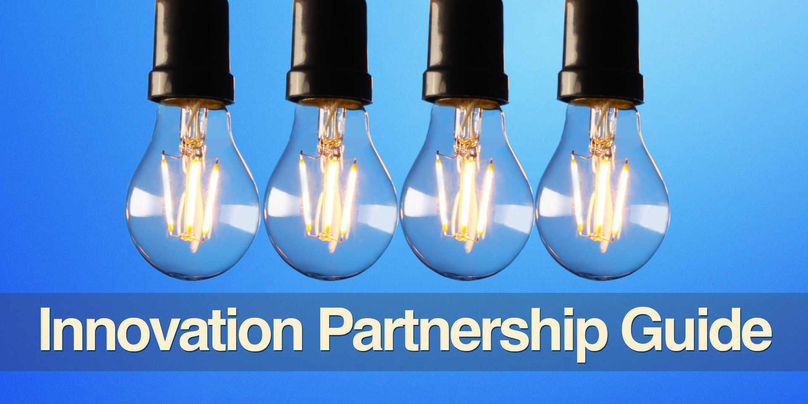

<!--
  * browser: innovation-partnership-guide
  * tracker: d7ccfdbf6e55782217db0f13368f17b3
  * version: 1.0.0
  * updated: 2023-07-26T11:45:12Z
  * contact: Joel Parker Henderson (https://joelparkerhenderson.com)
  * options: commentable
-->

# Innovation Partnership Guide

Innovation Partnership Guide. This book explains one topic per page, like a big glossary, easy wiki, quick encyclopedia, or summary notes.

* Get the book: 
  [Free EPUB](https://github.com/SixArm/innovation-partnership-guide/raw/main/innovation-partnership-guide.epub), 
  [Free PDF](https://github.com/SixArm/innovation-partnership-guide/raw/main/innovation-partnership-guide.pdf),
  [Gumroad](https://gumroad.com/l/innovation-partnership-guide),
  [Zylvie](https://zylvie.com/joelparkerhenderson/p/innovation-partnership-guide),
  [Kindle](https://www.amazon.com/dp/B0CP72F5D4), 
  [Paperback](https://www.amazon.com/dp/TODO).
* Edited by [Joel Parker Henderson](https://github.com/joelparkerhenderson).
* For questions and suggestions, [email me](mailto:joel@joelparkerhenderson.com).

## Contents

### [Introduction](topics/innovation-partnership-guide-introduction)

### [Innovation partnership](topics/innovation-partnership)

* [How to write a partnership statement](topics/how-to-write-a-partnership-statement)
* [How to find partnership opportunities](topics/how-to-find-partnership-opportunities)
* [How to formalize partnerships](topics/how-to-formalize-partnerships)
* [How to apply for grants](topics/how-to-apply-for-grants)

### [Innovation management](topics/innovation-management)

* [Drivers of the need for innovation](topics/drivers-of-the-need-for-innovation)
* [Degrees of innovation](topics/degrees-of-innovation)
* [Culture of innovation](topics/culture-of-innovation)
* [Open innovation](topics/open-innovation)
* [Voice of the Customer (VoC)](topics/voice-of-the-customer)
* [Subject Matter Expert (SME)](topics/subject-matter-expert)
* [Disruptive technology](topics/disruptive-technology)
* [Diffusion of innovations](topics/diffusion-of-innovations)
* [Stage-gate](topics/stage-gate)
* [Kondratiev long waves](topics/kondratiev-long-waves)
* [Contingency theory](topics/contingency-theory)

### [Strategic alignment](topics/strategic-alignment)

* [Strategic alliance](topics/strategic-alliance)
* [Strategic balanced scorecard (SBS)](topics/strategic-balanced-scorecard)
* [Strategic partnership versus tactical partnership](topics/strategic-partnership-versus-tactical-partnership)
* [Strategy map](topics/strategy-map)
* [Synergy](topics/synergy)

### [Business partnership types](topics/business-partnership-types)

* [Joint venture](topics/joint-venture)
* [Public-private partnership (PPP)](topics/public-private-partnership)
* [University partnership](topics/university-partnership)
* [Government partnership](topics/government-partnership)

## [Partnership life cycle (PLC)](topics/partnership-life-cycle)

* [Partnership Readiness Level (PRL)](topics/partnership-readiness-level)
* [Project portfolio management (PPM)](topics/project-portfolio-management)
* [Innovation Pentathlon framework](topics/innovation-pentathlon-framework)
* [Partner Relationship Management (PRM)](topics/partner-relationship-management)
* [Partnership metrics](topics/partnership-metrics)

## Strategy

### [Business model](topics/business-model)

* [Business Model Innovation (BMI)](topics/business-model-innovation)
* [Business Model Canvas (BMC)](topics/business-model-canvas)

### [Strategic effects](topics/strategic-effects)

* [Network effects](topics/network-effects)
* [Platform effects](topics/platform-effects)
* [Flywheel effects](topics/flywheel-effects)
* [Viral effects](topics/viral-effects)
* [Moat effects](topics/moat-effects)
* [Threshold effects](topics/threshold-effects)
* [Scale effects](topics/scale-effects)
* [Leverage effects](topics/leverage-effects)
* [Monopoly effects](topics/monopoly-effects)

### [Business growth models](topics/business-growth-models)

* [Market expansion](topics/market-expansion)
* [Product line extension](topics/product-line-extension)

### [Business analysis](topics/business-analysis)

* [North Star](topics/north-star)
* [Five Forces analysis](topics/five-forces-analysis)
* [PESTLE analysis](topics/pestle-analysis)
* [SWOT analysis](topics/swot-analysis)
* [Feasibility analysis](topics/feasibility-analysis)
* [Stakeholder analysis](topics/stakeholder-analysis)
* [Use case analysis](topics/use-case-analysis)
* [Process mapping](topics/process-mapping)
* [Value stream mapping (VSM)](topics/value-stream-mapping)
* [Maturity models](topics/maturity-models)
* [Demand forecasting](topics/demand-forecasting)
* [Predictive analytics](topics/predictive-analytics)

### [Business strategy and business tactics](topics/business-strategy-and-business-tactics)

* [Research and development (R&D)](topics/research-and-development)
* [Ability, capability, capacity](topics/ability-capability-capacity)
* [Business development](topics/business-development)
* [Outputs versus outcomes](topics/outputs-versus-outcomes)
* [Due diligence](topics/due-diligence)

### [Creative thinking techniques](topics/creative-thinking-techniques)

* [Ideation](topics/ideation)
* [Big Hairy Audacious Goal (BHAG)](topics/big-hairy-audacious-goal)
* [Brainstorming](topics/brainstorming)
* [Thinking hats](topics/thinking-hats)
* [SCAMPER](topics/scamper)
* [Futurespective](topics/futurespective)

### [Startup entrances](topics/startup-entrances)

* [Incubator](topics/incubator)
* [Accelerator](topics/accelerator)
* [Skunkworks](topics/skunkworks)
* [Spinoff](topics/spinoff)
* [Spinout](topics/spinout)
* [Technology transfer](topics/technology-transfer)

## Industry introductions

### [Roles and responsibilities](topics/roles-and-responsibilities)

* [Partnership Manager](topics/partnership-manager)
* [Product Manager](topics/product-manager)
* [Project Manager (PM)](topics/project-manager)
* [Responsibility assignment matrix (RAM)](topics/responsibility-assignment-matrix)
* [RACI matrix](topics/raci-matrix)
* [PARIS matrix](topics/paris-matrix)
* [Organizational chart](topics/organizational-chart)
* [Chain of command](topics/chain-of-command)
* [Stakeholders](topics/stakeholders)

### [Organizational values frameworks](topics/organizational-values-frameworks)

* [Code of conduct](topics/code-of-conduct)
* [Code of ethics](topics/code-of-ethics)
* [Membership values](topics/membership-values)
* [Leadership values](topics/leadership-values)
* [Cultural values](topics/cultural-values)
* [Social value orientation (SVO)](topics/social-value-orientation)
* [Culture fit and values alignment](topics/culture-fit-and-values-alignment)
* [Triple bottom line](topics/triple-bottom-line)
* [Cultural dimensions](topics/cultural-dimensions)

## Planning

### [Intent plan](topics/intent-plan)

* [Objectives and Key Results (OKRs)](topics/objectives-and-key-results)
* [Key Performance Indicators (KPIs)](topics/key-performance-indicators)
* [Risks, Actions, Issues, Decisions (RAID)](topics/risks-actions-issues-decisions)
* [SMART criteria](topics/smart-criteria)
* For more see [Project Management Guide](topics/https://github.com/sixarm/project-management-guide)

### [Project management](topics/project-management)

* [Project management life cycle (PMLC)](topics/project-management-life-cycle)
* [Project versus program](topics/project-versus-program)
* [Project portfolio management (PPM)](topics/project-portfolio-management)
* [Portfolio optimization](topics/portfolio-optimization)
* For more see [Project Management Guide](topics/https://github.com/sixarm/project-management-guide)

### [Teamwork](topics/teamwork)

* [Forming, Storming, Norming, Performing (FSNP)](topics/forming-storming-norming-performing)
* [Icebreaker questions](topics/icebreaker-questions)
* [TEAM FOCUS](topics/team-focus)
* [Active listening](topics/active-listening)
* [Shoshin](topics/shoshin)
* [Blameless retrospective](topics/blameless-retrospective)
* [Dialogic Organization Development](topics/dialogic-organization-development)

## [Digital transformation](topics/digital-transformation)

* [Business information systems](topics/business-information-systems)
* [Change management](topics/change-management)
* [Standard Operating Procedure (SOP)](topics/standard-operating-procedure)
* [Playbook](topics/playbook)
* [Runbook](topics/runbook)

### [Artificial intelligence (AI)](topics/artificial-intelligence)

* [AI for partner management](topics/ai-for-project-management)
* [AI for product development](topics/ai-for-product-development)
* [AI for project management](topics/ai-for-project-management)
* [AI for business strategy](topics/ai-for-business-strategy)

## Law

### [Intellectual Property (IP)](topics/intellectual-property)

* [Patent](topics/patent)
* [Copyright](topics/copyright)
* [Trademark](topics/trademark)
* [Trade secret](topics/trade-secret)
* [Industrial design rights](topics/industrial-design-rights)

### [Legal agreements](topics/legal-agreements)

* [Partnership agreement](topics/partnership-agreement)
* [Joint Venture agreement (JVA)](topics/joint-venture-agreement)
* [Framework agreement](topics/framework-agreement)
* [Service agreement](topics/service-agreement)
* [Consulting agreement](topics/consulting-agreement)
* [Subcontracting agreement](topics/subcontracting-agreement)
* [Confidentiality agreement](topics/confidentiality-agreement)
* [Non-disclosure agreement (NDA)](topics/non-disclosure-agreement)
* [Non-compete agreement](topics/non-compete-agreement)
* [Non-solicitation agreement](topics/non-solicitation-agreement)
* [Work-for-hire agreement](topics/work-for-hire-agreement)
* [Arbitration agreement](topics/arbitration-agreement)
* [Letter Of Intent (LOI)](topics/letter-of-intent)
* [Power Of Attorney (POA)](topics/power-of-attorney)
* Memorandum Of Understanding (MOU): see Letter Of Intent (LOI)
* Master Services Agreement (MSA): see Framework agreement

### [Technology transfer agreements](topics/technology-transfer-agreements)

* [Licensing agreement (LA)](topics/licensing-agreement)
* [Joint development agreement (JDA)](topics/joint-development-agreement)
* [Assignment agreement (AA)](topics/assignment-agreement)
* [Cooperative Research and Development Agreement (CRADA)](topics/cooperative-research-and-development-agreement)
* [Facility Use/Service Agreement (FUSA)](topics/facility-use-service-agreement)
* [Material Transfer Agreement (MTA)](topics/material-transfer-agreement)
* [Technical Assistance Agreement (TAA)](topics/technical-assistance-agreement)
* [Technology Transfer Office (TTO)](topics/technology-transfer-office)

## Lore

### [Partnership quotations](topics/partnership-quotations)

* [If you want to go fast go alone; if you want to go far go together](topics/if-you-want-to-go-fast)
* [Perfect partners don't exist](topics/perfect-partners-dont-exist)
* [The whole is greater than the sum of the parts](topics/the-whole-is-greater-than-the-sum-of-the-parts)

### [Idioms](topics/idioms)

* [Ahead of the pack](topics/ahead-of-the-pack)
* [Shoulder to shoulder](topics/shoulder-to-shoulder)
* [The ball is in your court](topics/the-ball-is-in-your-court)
* [Think outside of the box](topics/think-outside-of-the-box)
* For more see our [Business Lingo Guide](topics/https://github.com/sixarm/business-lingo-guide)

### [Aphorisms](topics/aphorisms)

* [The Law of Demos (Kapor's Law)](topics/the-law-of-demos)
* [The Law of Conservation of Complexity (Tesler's Law)](topics/the-law-of-conservation-of-complexity)
* [The Pareto Principle (The 80/20 Rule)](topics/the-pareto-principle)
* [Chesterton's fence](topics/chestertons-fence)
* For more see our [Business Lingo Guide](topics/https://github.com/sixarm/business-lingo-guide)

### [Soft skills](topics/soft-skills)

* [How to collaborate](topics/how-to-collaborate)
* [How to work with stakeholders](topics/how-to-work-with-stakeholders)
* [How to lead a meeting](topics/how-to-lead-a-meeting)
* [How to get feedback](topics/how-to-get-feedback)
* [How to give feedback](topics/how-to-give-feedback)

### [Conclusion](topics/innovation-partnership-guide-conclusion)

* [About the editor](topics/about-the-editor)
* [About the AI](topics/about-the-ai)
* [About the ebook](topics/about-the-ebook-pdf)
* [About related projects](topics/about-related-projects)

## All our guides

* [Innovation Partnership Guide](https://github.com/sixarm/innovation-partnership-guide)
* [Startup Business Guide](https://github.com/sixarm/startup-business-guide)
* [Business Lingo Guide](https://github.com/sixarm/business-lingo-guide)
* [Project Management Guide](https://github.com/sixarm/project-management-guide)
* [UI/UX Design Guide](https://github.com/sixarm/ui-ux-design-guide)
